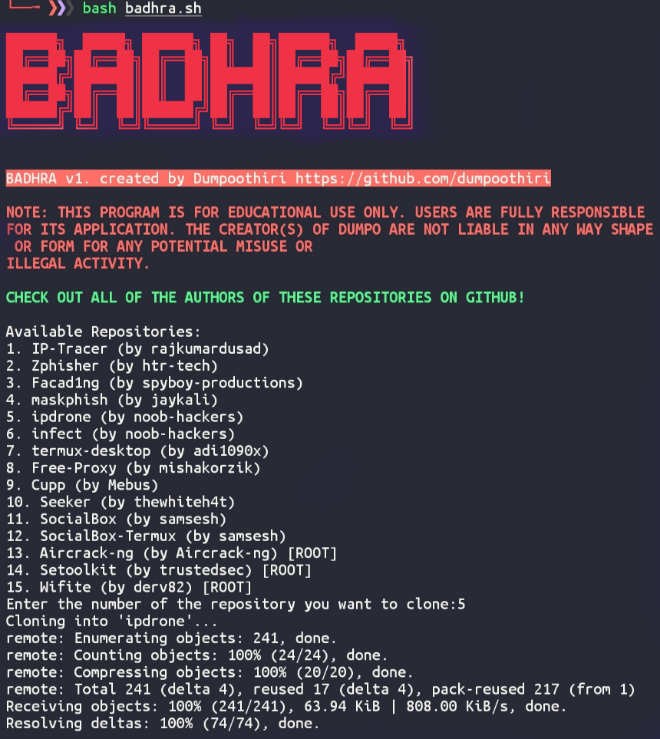

    


## WHAT IS IT?
"Badhra" is a program which you can use to download some of the most popular tools for Termux and Kali Linux. It contains repositories which can be used for many different purposes, from tracing IP addresses to generating password lists. 

Be sure to use this program as well as the repositories within responsibly, ethically, and most importantly, legally.
## HOW TO DOWNLOAD AND RUN:
```bash
apt update

apt install git -y

git clone https://github.com/dumpoothiri/badhra

cd badhra

bash badhra.sh
```
It's that easy!
## WHAT IT LOOKS LIKE:


(example of "Badhra" running on termux)
## RECOMMENDATION(S)
It is highly reccomended that users move the "badhra.sh" file out of its directory once it is installed. This will ensure that the repositories you choose to download are installed into the home folder, and not into the badhra directory, making them significantly easier to access. You can do this using the following guide:

[Guide](moving-badhra.md)

## DISCLAIMER
Usage of the repositories contained within "badhra" for attacking targets without prior mutual consent is illegal. The application of "Badhra" and the repositories within is the full responsibility of the user. "dumpoothiri" assumes no liability and is not responsible for any potential misuse of this program.

## CREDITS:
IP-Tracer (by rajkumardusad): [https://github.com/rajkumardusad/IP-Tracer](https://github.com/rajkumardusad/IP-Tracer)  

Zphisher (by htr-tech): [https://github.com/htr-tech/zphisher](https://github.com/htr-tech/zphisher)  

Facad1ng (by spyboy-productions): [https://github.com/spyboy-productions/Facad1ng](https://github.com/spyboy-productions/Facad1ng)

maskphish (by jaykali): [https://github.com/jaykali/maskphish](https://github.com/jaykali/maskphish)

ipdrone (by noob-hackers): [https://github.com/noob-hackers/ipdrone](https://github.com/noob-hackers/ipdrone)  

infect (by noob-hackers): [https://github.com/noob-hackers/infect](https://github.com/noob-hackers/infect)

termux-desktop (by adi1090x): [https://github.com/adi1090x/termux-desktop](https://github.com/adi1090x/termux-desktop)  

Free-Proxy (by mishakorzik): [https://github.com/mishakorzik/Free-Proxy](https://github.com/mishakorzik/Free-Proxy)

cupp (by Mebus): [https://github.com/Mebus/cupp](https://github.com/Mebus/cupp)

Seeker (by thewhiteh4t): [https://github.com/thewhiteh4t/seeker](https://github.com/thewhiteh4t/seeker)

SocialBox (by Belahsan Ouerghi): [https://github.com/samsesh/SocialBox](https://github.com/samsesh/SocialBox)

SocialBox-Termux (by Belahsan Ouerghi): [https://github.com/samsesh/SocialBox-Termux](https://github.com/samsesh/SocialBox-Termux)

Aircrack-ng (by Aircrack-ng): [https://github.com/aircrack-ng/aircrack-ng](https://github.com/aircrack-ng/aircrack-ng)

Setoolkit (by trustedsec): [https://github.com/trustedsec/social-engineer-toolkit](https://github.com/trustedsec/social-engineer-toolkit)

Wifite (by derv82): [https://github.com/derv82/wifite](https://github.com/derv82/wifite)
